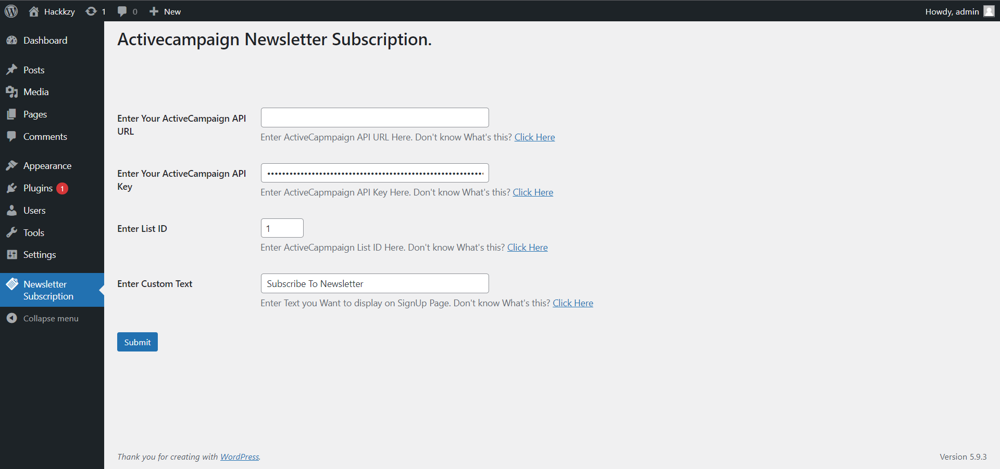
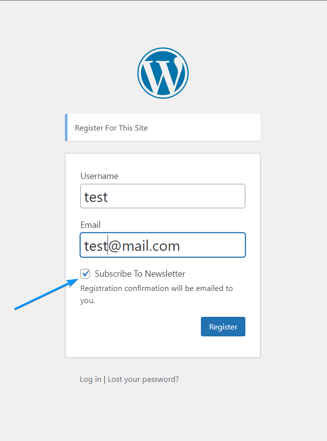
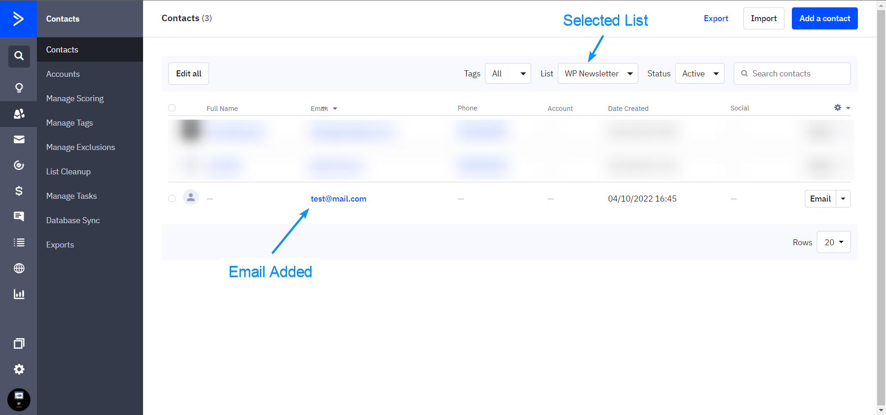

# ActiveCampaign Newsletter Subscription #
- **Contributors:** bhargavbhandari90, hackkzy404
- **Tags:** activecampaign, newsletter, newsletter subscription, active campaign 
- **Requires at least:** 4.0 
- **Tested up to:** 6.0
- **Requires PHP:** 5.6 
- **Stable Tag:** 1.0.2
- **License:** GPLv2 or later
- **License URI:** http://www.gnu.org/licenses/gpl-2.0.html 

## Description ##

This is Newsletter Subscription Plugin, Which is used to add users to Selected ActiveCampaign List.

## Pro Features ##

- Supports thirdparty Plugins
- This pro plugin has compatibility with the following plugins:
	1. *Buddypress*
	2. *WooCommerce*
> [Get ActiveCampaign Newsletter Subscription Pro](https://buntywp.gumroad.com/l/dxitz)

## How to use? ##

1. Go to "Newsletter Subscription" tab in backend.
2. Enter Active Campaign "API URL" and "API Key". [Learn More](https://i.imgur.com/wA2BEPl.png)
3. Enter Active Campaign "List ID" where you want to add Email. If you don't add List ID than By default users will added to "Contacts".
4. Add Custom Text If you Want, This text will display on SignUP Page with Checkbox.

	

5. If user select This Checkbox, than user will be added to ActiveCampaign.

	

6. User will be added to ActiveCampaign List.

	

## How to Configure? ##
https://youtu.be/VeHCBy9Gv5A

## Installation ##
1. Upload "activecampaign-newsletter-subscription" to the "/wp-content/plugins/" directory using FTP or upload plugin zip using upload button.
2. Activate the plugin through the "Plugins" menu in WordPress.

## Changelog ##

### 1.0.2 ###
* Changes related to Pro plugin.
### 1.0.1 ###
* Compatibility with pro plugin.
### 1.0.0 ###
* Initial release.
